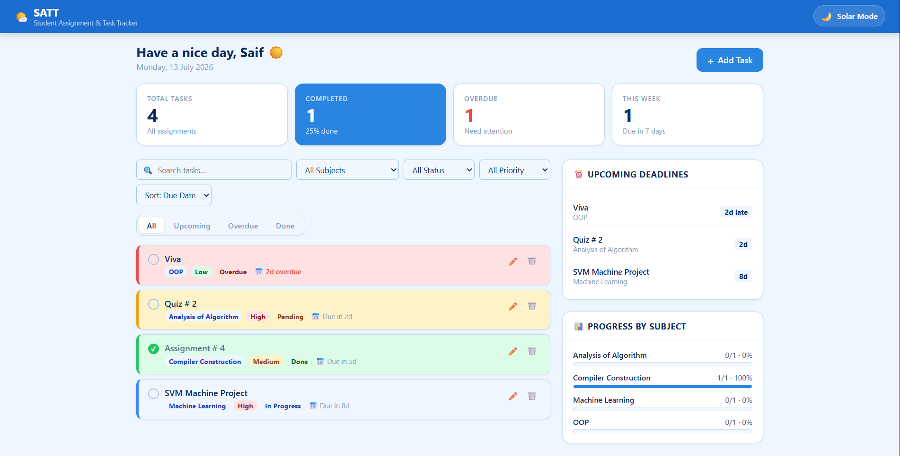

# SATT – Student Assignment📅📚 & Task Tracker📊✅

> A modern, component-driven React application for managing academic deadlines, tracking subject-wise progress, and organizing daily tasks.

SATT was built to simplify student life by keeping all assignments in one accessible dashboard. Originally designed with a Node.js/SQLite backend, this project has been refactored into a lightning-fast, purely client-side React application that securely persists user data directly in the browser.

---

## 🚀 Live Demo
🔴 **Experience the app here:** https://student-tasks-tracker.vercel.app/

---

## 📸 Preview



---

## ✨ Key Features

* **Zero-Backend Architecture:** Fully relies on the browser's Local Storage API, meaning no server configuration, instant load times, and complete data privacy for the user.
* **Dynamic Dual-Theming:** Toggle seamlessly between "Day Mode" (a bright, sky-blue interface) and "Solar Mode" (a deep space dark theme complete with a live interactive `<canvas>` starfield).
* **Smart Analytics & Progress:** Automatically calculates completion percentages per subject and generates dynamic visual progress bars.
* **Urgency Indicators:** The "Upcoming Deadlines" sidebar auto-detects overdue tasks and color-codes assignments based on how many days remain.
* **Advanced Data Controls:** Instantly filter tasks by Subject, Status (Pending, In Progress, Done, Overdue), or Priority (High, Medium, Low).

---

## 🛠️ Tech Stack

* **Frontend Framework:** React.js (via Vite)
* **State Management:** React Hooks (`useState`, `useEffect`)
* **Data Persistence:** Browser Local Storage
* **Styling:** Custom CSS with dynamic CSS Variables for theming
* **Deployment:** Vercel

---

## 📂 Component Architecture

The application is modularized using standard React best practices for ultimate Separation of Concerns:

```text
src/
├── components/
│   ├── Navbar.jsx        # Top navigation and theme toggle logic
│   ├── StatsRow.jsx      # Top-level numerical dashboard summaries
│   ├── TaskControls.jsx  # Search, filter, and sorting inputs
│   ├── TaskList.jsx      # Maps and renders the filtered array of tasks
│   ├── TaskCard.jsx      # Individual assignment UI and dynamic color badging
│   ├── Sidebar.jsx       # Upcoming deadlines and subject progress bars
│   └── TaskModal.jsx     # Reusable form overlay for creating/editing tasks
├── App.jsx               # Main state container and Local Storage synchronization
├── utils.js              # Shared helper functions (e.g., dynamic subject colors)
└── index.css             # Global theme tokens and styles

```

---

## 💻 Run Locally

To get a local copy up and running, follow these simple steps:

1. **Clone the repository**
```bash
git clone https://github.com/MSaifUdDin-999/Student_Assignment_Test_Tracker.git

```


2. **Navigate into the directory**
```bash
cd SATT-react

```


3. **Install dependencies**
```bash
npm install

```


4. **Start the Vite development server**
```bash
npm run dev

```


*The app will automatically open at `http://localhost:5173`.*

---

## 🌟 Let's Connect

Thanks for checking out this project!

I'm **M Saif Ud Din**, a Full-stack developer passionate about building clean, responsive, and real-world web applications while continuously exploring modern technologies.

Linkedin : **https://www.linkedin.com/in/muhammad-saif-ud-din-0b604840b/**

GitHub : **https://github.com/MSaifUdDin-999**

Email : **mrsaif1166@gmail.com**

If you enjoyed this project:

- ⭐ Star this repository
- 🍴 Fork it and build something awesome
- 💬 Share your feedback or suggestions

Happy Coding! 🚀

---

*Developed with ❤️ by M SAIF UD DIN*
